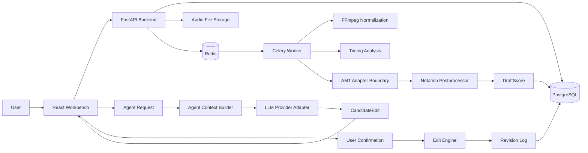

# Technical Architecture

## Architecture Overview

AgentClef uses a Web-first architecture with a Python backend, asynchronous transcription workers, structured music state, and an Agent review layer.

```text
Browser Workbench
-> FastAPI Backend
-> Redis / Celery Queue
-> Audio Pipeline Worker
-> AMT Adapter
-> Notation Postprocessor
-> DraftScore
-> Agent Context Builder
-> CandidateEdit
-> User Confirmation
-> Revision
```

## System Diagram



## Module Responsibilities

### Web Workbench

- Upload audio.
- Display transcription task state.
- Render waveform and editable note timeline.
- Manage local selection.
- Display Agent conversation and CandidateEdit proposals.
- Confirm or reject candidate edits.
- Show revision history.

### FastAPI Backend

- Own project, audio, task, draft, Agent, edit, and revision APIs.
- Validate request and response schemas.
- Coordinate task creation.
- Build Agent context.
- Validate and apply CandidateEdit operations.

### PostgreSQL

- Store project metadata.
- Store audio asset metadata.
- Store transcription tasks.
- Store DraftScore payloads.
- Store Agent messages, CandidateEdit records, and revisions.
- Use SQLAlchemy ORM models as the application persistence mapping.
- Use Alembic migrations as the schema change history.
- Store structured DraftScore, Agent context, CandidateEdit, and Revision payloads as JSONB in PostgreSQL.

### Redis and Celery

- Queue transcription jobs.
- Run long audio and model pipeline tasks outside request lifecycle.
- Track task progress and failure states.
- v0.1 worker baseline connects task dispatch to the first stored audio-to-DraftScore pipeline.
- Worker tasks update persisted TranscriptionJob state through the repository layer.

### Audio Pipeline Worker

- Resolve stored audio through storage-root constrained paths.
- Handle WAV inputs through the Python standard library copy and metadata path; normalize non-WAV inputs through system FFmpeg when available.
- Produce deterministic timing and AMT candidates through replaceable adapter boundaries.
- Generate initial NoteEvent candidates and uncertainty markers.
- Persist schema-validated DraftScore payloads.

librosa and Basic Pitch remain target adapter technologies for model-backed transcription iterations. The current baseline keeps CI deterministic while preserving the replacement boundary.

### Agent Layer

- Build local musical context from SelectionRange and DraftScore.
- Call an LLM provider through an adapter.
- Validate structured Agent output.
- Return CandidateEdit proposals.

### Edit Engine

- Validate CandidateEdit target version.
- Apply confirmed edits to DraftScore.
- Write Revision records.
- Preserve DraftScore as the system source of truth.

## API Style

v0.1 uses:

- REST for project, upload, task, draft, edit, and revision resources.
- Multipart upload for audio files.
- Server-Sent Events for task progress and Agent streaming output.

WebSocket is reserved for future real-time collaboration or richer bidirectional session needs.

## Deployment Shape

v0.1 uses a modular monolith plus worker shape:

```text
web/
server/
worker/
shared domain schemas
PostgreSQL
Redis
file storage
```

Service extraction is deferred until actual scaling, deployment, or model isolation requirements appear.
