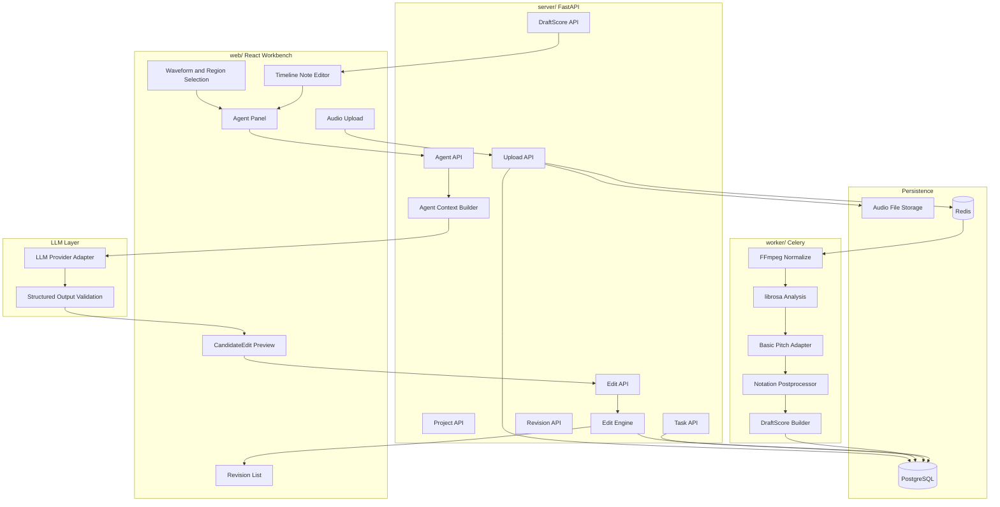
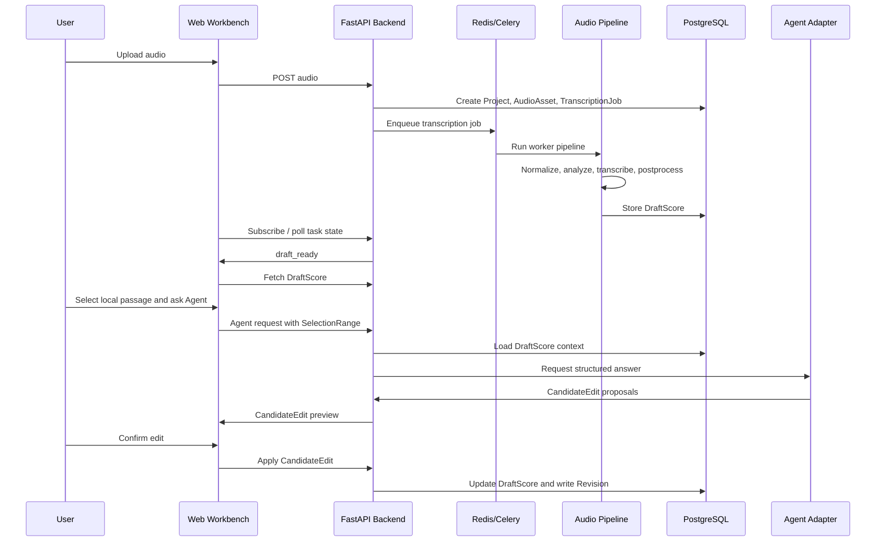

# AgentClef v0.1 Architecture

> Milestone: `v0.1-transcription-review-loop`
>
> Stage goal: implement the minimum audio-to-draft-to-Agent-review loop.
>
> Stage boundary: v0.1 does not implement full multi-instrument score transcription, external video ingestion, OMR, full notation editing, multi-user collaboration, or full export format coverage.

## Implementation Architecture



## Primary Flow

```text
User uploads audio
-> FastAPI stores AudioAsset and creates TranscriptionJob
-> FastAPI dispatches the TranscriptionJob to Celery
-> Celery worker normalizes audio
-> Pipeline generates BeatGrid, NoteEvent, optional ChordEvent
-> Backend stores DraftScore
-> Workbench renders waveform and note timeline
-> User selects local passage
-> Agent context builder extracts local score and audio context
-> LLM adapter returns validated CandidateEdit proposals
-> User confirms one proposal
-> Edit Engine applies it to DraftScore
-> Backend writes Revision
```

## v0.1 Modules

| Module | Directory | Responsibility |
| :--- | :--- | :--- |
| Web Workbench | `web/` | Upload, waveform, note timeline, Agent panel, edit preview |
| API Backend | `server/` | Project, upload, task, draft, Agent, edit, revision APIs |
| Worker | `worker/` | Audio normalization, AMT baseline, postprocessing |
| Persistence | PostgreSQL / file storage | Project, task, DraftScore, audio metadata, CandidateEdit, Revision |
| Queue | Redis / Celery | Long transcription job dispatch |
| Agent Layer | provider adapter | Structured reasoning and CandidateEdit generation |

The worker baseline introduces explicit task dispatch and persisted TranscriptionJob status updates. Full audio normalization and transcription are connected in the pipeline baseline issue.

## v0.1 Data Flow



## v0.1 Runtime States

```text
created
-> uploaded
-> preprocessing
-> transcribing
-> postprocessing
-> draft_ready
-> editing
-> candidate_pending
-> candidate_applied
```

Failure states:

```text
upload_failed
preprocessing_failed
transcription_failed
postprocessing_failed
agent_failed
candidate_conflict
candidate_apply_failed
```
